# Relatório Projeto CrocShare


## What is CrocShare

CrocShare is a platform for sharing educational resources. It was developed as a project within the Web Engineering course in the Software Engineering degree.

It is a simple and intuitive application that allows the sharing of resources, either publicly or privately. If you choose to share a resource privately, you can add users and/or groups previously created to have access to the resource.

The resources are organized according to their category. On the home page there are filters that make it possible to view resources by category, year, groups among other alternatives that facilitate the search.

You can save resources as favorites and they become available for viewing on your account page. You can also filter the resources per ranking according to the number of favorites the resources have received. You can also comment on resources, as well as edit or delete your comments.

There are three user levels: administrator, producer and consumer. When creating an account you can choose between producer or consumer. The producer can upload resources, delete and edit his own resources, create and manage his groups. The consumer can only download resources, comment on them and save them as favorites.

Administrators can delete any resources, groups, or comments in order to maintain the rules in case of improper user behavior. They are also the only ones allowed to create categories.

## Why CrocShare
The name "CrocShare" exhibits both imagination and memorability, making it a distinct and captivating choice within the competitive landscape of educational applications.

The term "Croc" alludes to the crocodile, a creature known for its longevity and constant growth throughout its lifespan. This association conveys the idea of continuous knowledge sharing and skill development that users can expect when utilizing the application.

In addition to its conceptual appeal, "CrocShare" boasts simplicity, a crucial factor in today's world where consumer attention spans are limited. Its brevity and ease of remembrance contribute to its potential success.

Furthermore, "CrocShare" possesses the advantage of being easily pronounceable across various languages, enabling seamless communication and accessibility for users from diverse linguistic backgrounds.

The name also lends itself to versatility. By leveraging the "Croc" element, it becomes possible to create a friendly and relatable mascot for the application. This approach can foster an emotional connection with users, enhancing their engagement and overall experience.

## Structure

- This project is the junction of three applications.

    - Backend
    - Frontend
    - auth-servers-2023

The Backend server is the API server which helds the groups, resources and categories models. The auth-servers-2023 is the server that handles the users and authentication. Finally, the FrontEnd server is the Interface.

## Database

This project needs two diferent databases: recursos and users. The database users saves all the information of the users. The other database saves all the information of the resources, of the groups and of the categories. 

To create a database, we used the following commands:
```sh
    python3 generator.py 10000 . exemplo.json

    mongoimport -d recursos -c recursos --file entries_exemplo.json --jsonArray
    mongoimport -d recursos -c groups --file groups_exemplo.json --jsonArray
    mongoimport -d authProject -c users --file users_exemplo.json --jsonArray
    mongoimport -d recursos -c categorias --file categories_exemplo.json --jsonArray
```

The script generator creates four json files with the information to add to the databases. In this case, it was ran the script in the same folder of the files to add. Also, it was choosed to add 10000 different users and to the json files created to have the name exemplo. In summary,

    Usage: python generator.py <user_amount> <root_dir> <output_file>

The files entries_exemplo.json, groups_exemplo.json, users_exemplo.json and categories_exemplo.json.

## How to execute

To make it easier to run and/or set up, it was created two scripts: 
 
 - setup.sh: installs all the packages needed, creats all the databases and respecives collections with information, and starts all the programs. This takes care of all the usual workflow the person setting up the server would have to do on the first time.

 - run_servers.sh: this scripts just install the packages, if the folder 'node_modules' isn't found on the root directory of each server, and run the programs. This also takes care of logging, allowing all programs to be ran in the same console.

All the logs are saved in the folder `logs`, if not found, this folder is created automatically. Each server has, additionally to the normal output log, an error log file that allows for debugging of critical errors.


## Routes

### Index
On this homepage, if the user is not logged in, they must choose to either log in or create an account. In case they have forgotten their password, there is an option to recover their account.

To create an account, the user must correctly fill in the displayed fields. If an account with the chosen username or email already exists, a message is displayed to the user. The password has specific requirements to ensure an adequate strength, which is appropriately indicated to the user.

<div style="text-align: center;">
    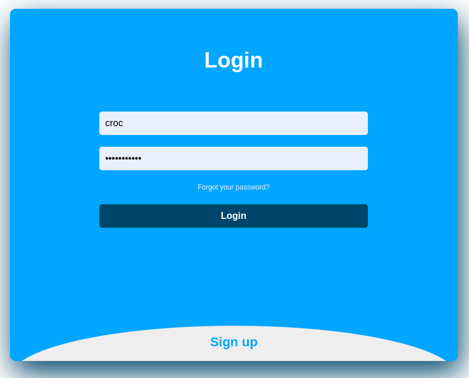
</div>

<div style="text-align: center;">
    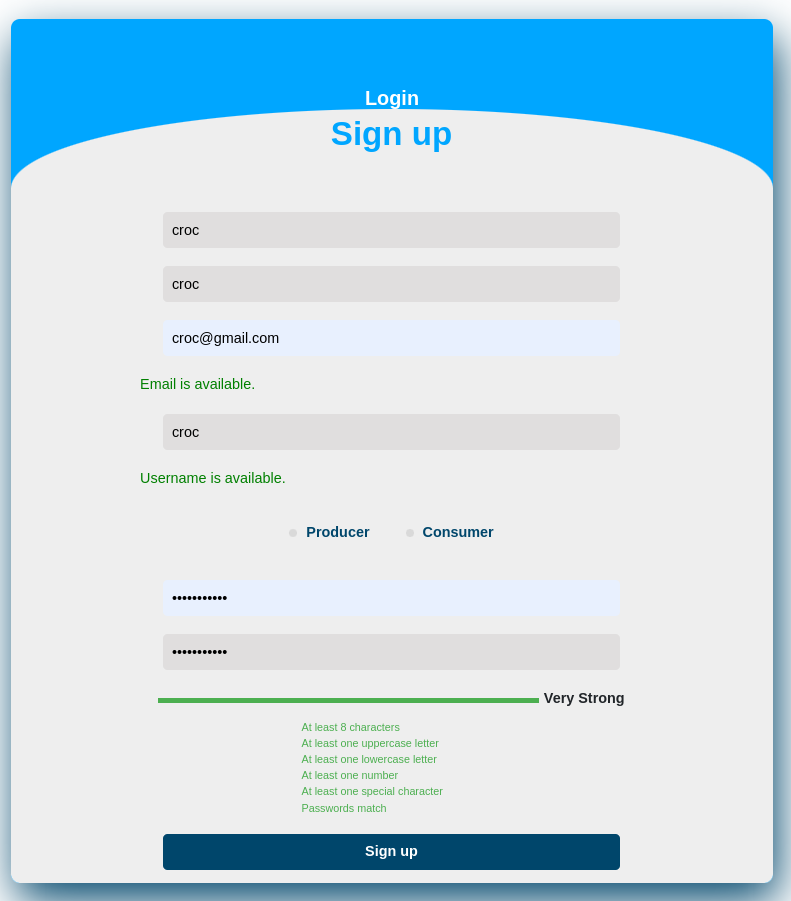
</div>

### All resources page
There are several options for filtering the resources. Regarding sorting, it is possible to sort them by ascending and descending date, alphabetically, by size, and by favorite ranking. As for filtering, it is possible to filter them by resource type, category, and groups. Lastly, you can select a filter, a condition, and enter a keyword or value for the search.

<div style="text-align: center;">
    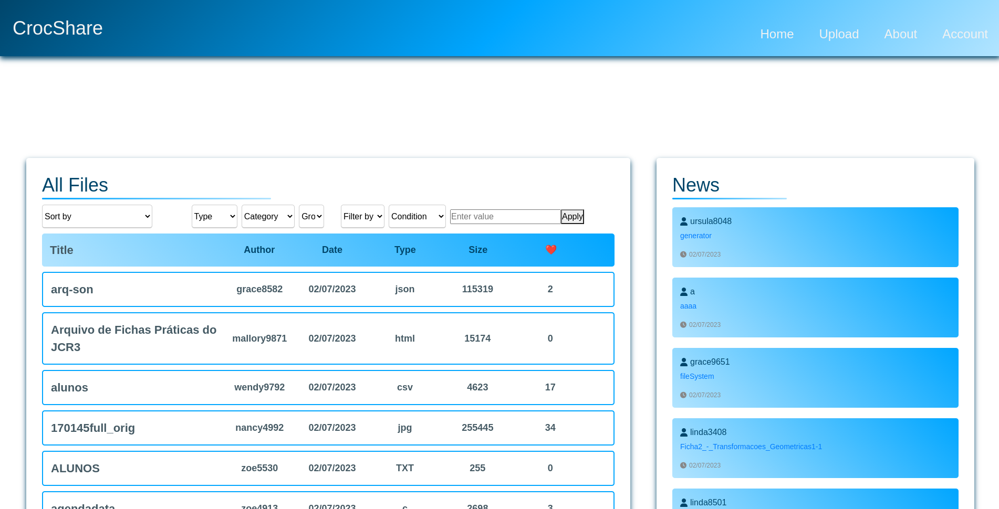
</div>

### Resource Page
The resource producer who submitted the resource can edit the fields related to the resource. Administrators have the ability to delete any resources, while producers can only delete their own resources. When selecting the delete icon, a window appears to confirm if the user wants to proceed, with a notice that the action cannot be undone.

Users have the option to save a resource as a favorite, which is stored in their account under the "Saved" tab.

Users can comment on resources. They have the ability to delete or edit their own comments, while administrators can delete any comments.

<div style="text-align: center;">
    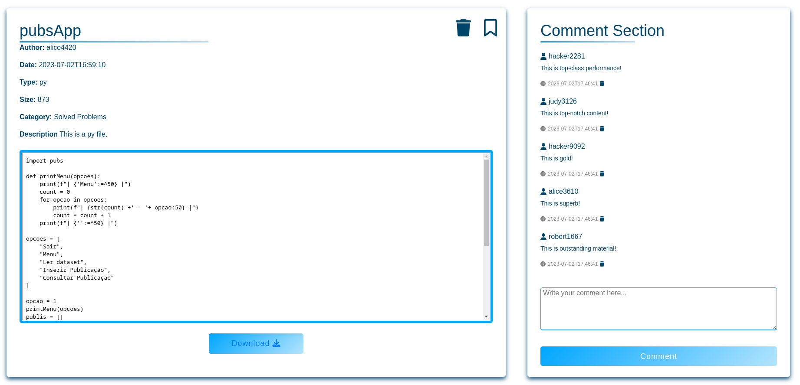
</div>


### Upload Resource
When submitting a resource, the user must fill in the indicated fields on the page. They can select a category from the available options. They should also choose whether the resource will have public or private visibility.

If the visibility of the resource is set to private, the user can search for specific users and groups and select them. Only the selected users and the author will have access to the resource.

<div style="text-align: center;">
    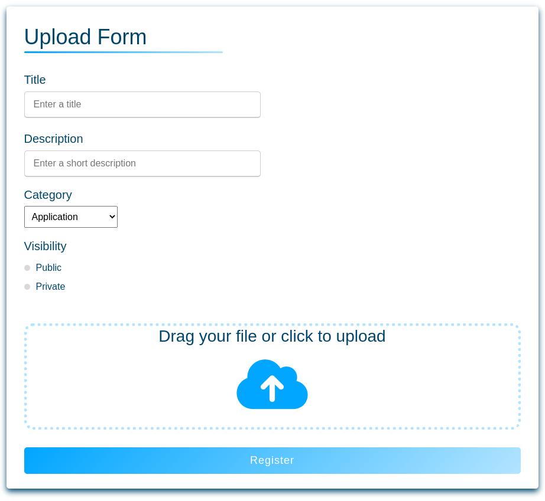
</div>

### Edit Resource
The resource producer has the ability to edit the fields related to the resource. They can change the title, description, category, and visibility of the resource. This allows them to update and modify the information associated with the resource as needed.

<div style="text-align: center;">
    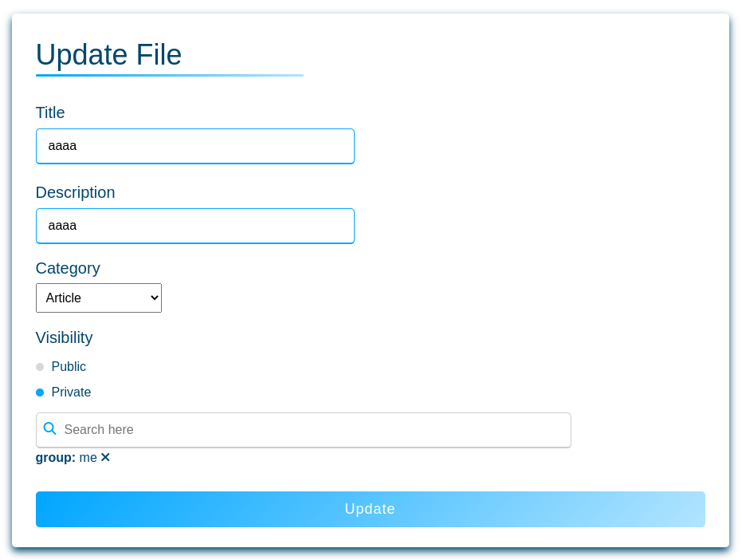
</div>

### Account

On the user account page, users have the ability to edit fields related to their profile, such as their name, surname, biography, and occupation. They can also modify their password. There are tabs to display the groups the user belongs to, the files they have submitted (if they are a producer), and the files saved as favorites. Additionally, users can log out from their account.

If the user is an administrator, there is an additional tab that displays the existing categories, where they can also add new categories as needed. This allows administrators to manage and expand the categories available within the application.

<div style="text-align: center;">
    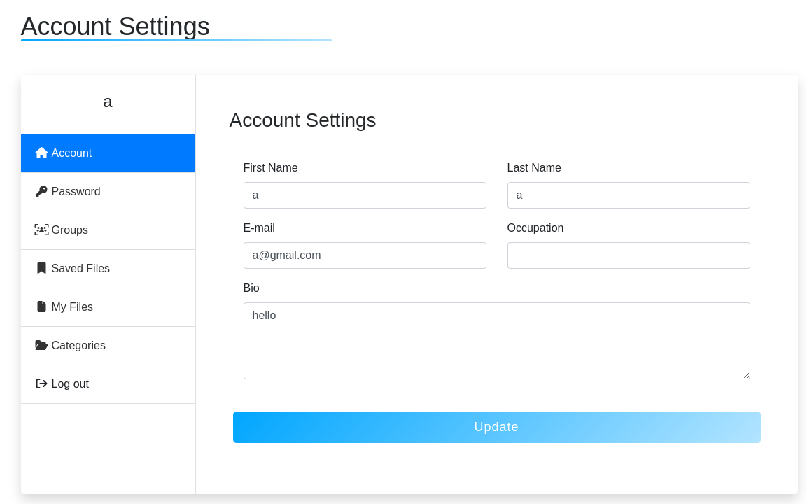
</div>

<div style="text-align: center;">
    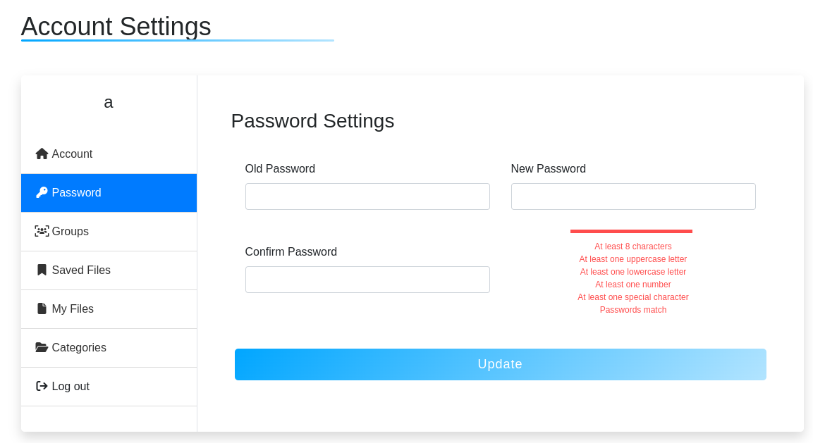
</div>

<div style="text-align: center;">
    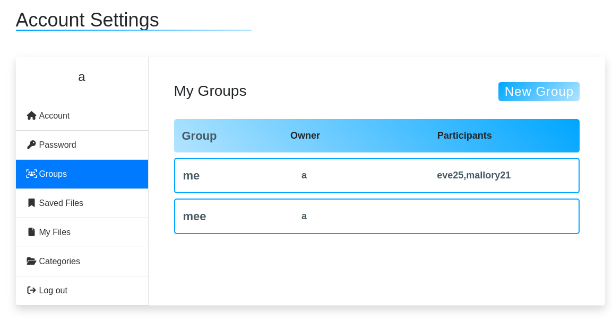
</div>

<div style="text-align: center;">
    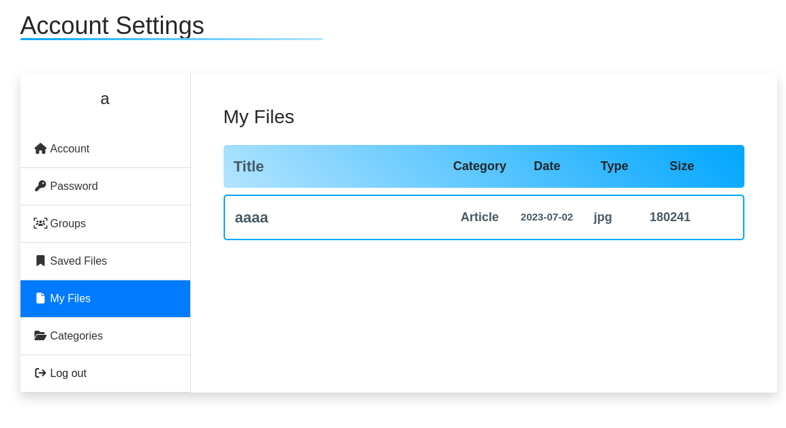
</div>

<div style="text-align: center;">
    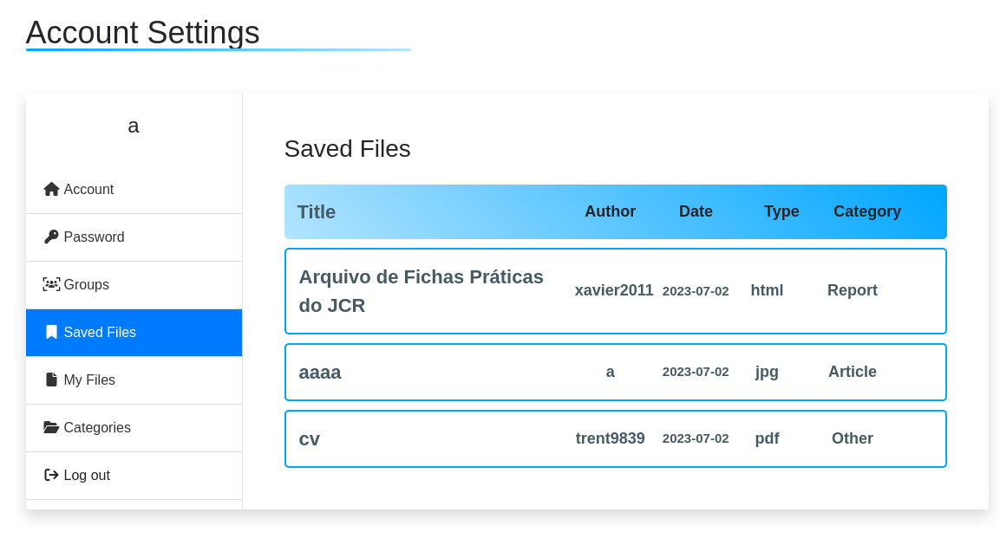
</div>

<div style="text-align: center;">
    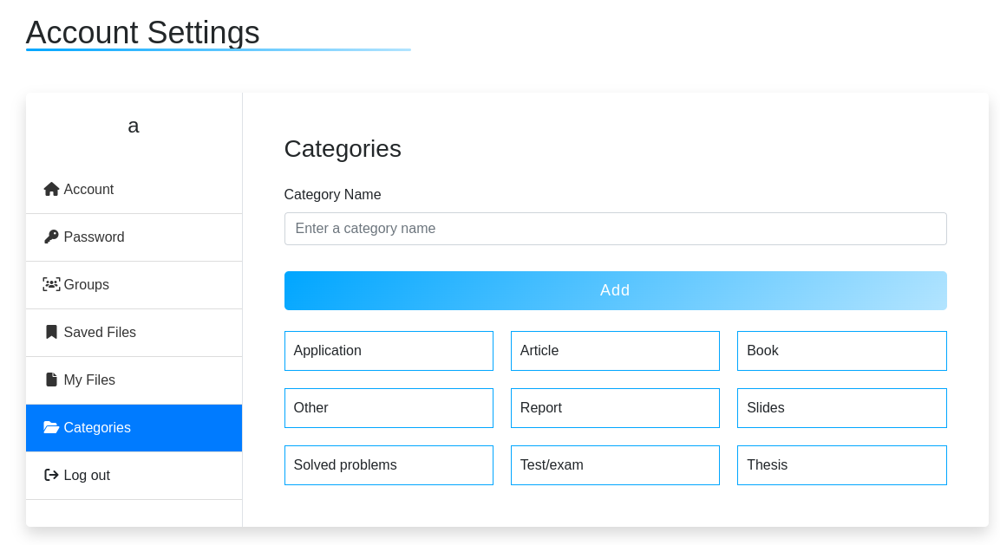
</div>


### User Profile
When visiting the profile of another user, it is possible to view the files submitted by that user as well as the information displayed on their profile. This provides a way to explore and access the files shared by other users, while also gaining insights into their profile details.

<div style="text-align: center;">
    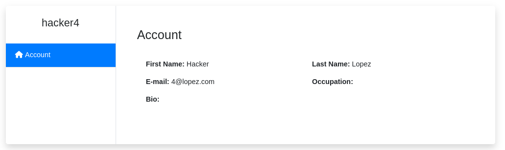
</div>

### Group Page
On the group page, users can view all the files associated with the group. If the user is the owner of the group or an administrator, they have the ability to delete the group and manage the group members. This includes removing users from the group or adding new users to the group. This feature allows for effective group administration and user management within the application.

<div style="text-align: center;">
    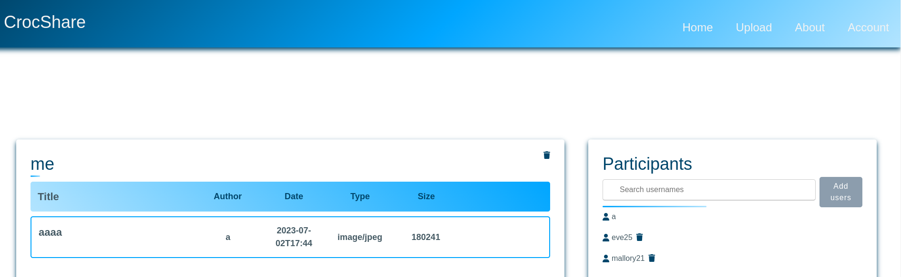
</div>

### New Group
Administrators and producers have the ability to create new groups within the application. This feature allows them to organize resources and users based on specific themes, subjects, or interests. By creating new groups, administrators and producers can foster collaboration and facilitate the sharing and management of resources among a targeted community of users.

<div style="text-align: center;">
    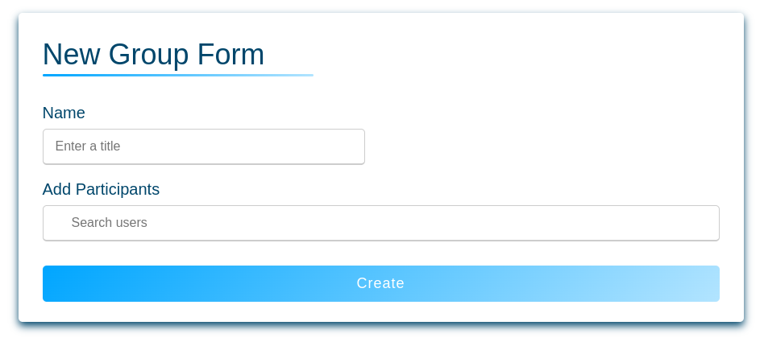
</div>


